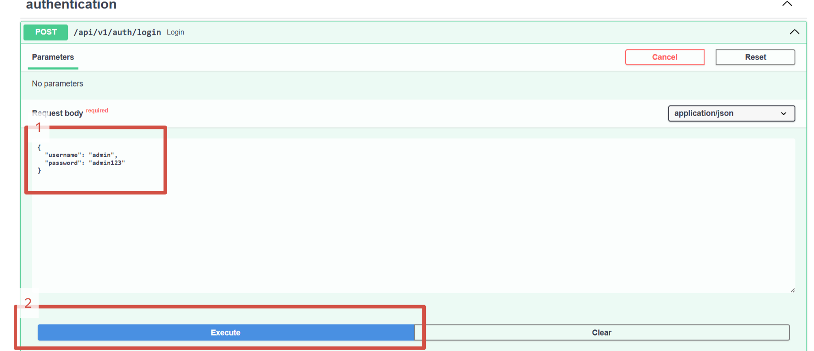

# Booking Service - Meeting Room Booking System

A RESTful API service for managing meeting room bookings in a coworking space.

## Features

- 🔐 JWT-based authentication with role-based access control (Employee/Admin)
- 🏢 Room management and availability checking
- 📅 Time slot-based booking system
- 👥 Employee: View rooms, create/cancel own bookings
- 👑 Admin: Full control over rooms, users, and all bookings
- 🐳 Docker containerization for easy deployment
- 📊 PostgreSQL database for persistent storage

## Technology Stack

- Python 3.11+
- FastAPI
- PostgreSQL
- SQLAlchemy ORM
- JWT Authentication
- Docker & Docker Compose
- Poetry for dependency management
- Pytest for testing

## Prerequisites

- Docker and Docker Compose
- Python 3.11+ (for local development)
- Poetry (for local development)

## Installation & Running

### Using Docker (Recommended)

1. Clone the repository:
```bash
git clone <repository-url>
cd .\booking_service\ 

docker-compose up -d

# Ждем 10 секунд, пока база данных поднимется
Start-Sleep -Seconds 10

 
#  Заполняем базу данных
docker-compose exec app python scripts/seed_data.py

# Проверяем работоспособность
curl http://localhost:8000/health

# Admin authorizations


{
  "username": "admin",
  "password": "admin123"
}